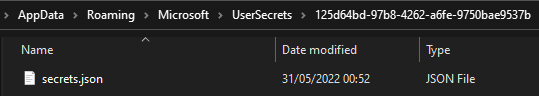

Using Config as of ASP .NET 6
==========================

Using configuration in ASP .NET Core based on the [video from Rahul Nath](https://youtu.be/5GlgHV_12-k).

Updated to **.NET 6** where `Program.cs` has replaced `Startup.cs`.

## Notes

### Hierarchical Key Notation

The separator to hierarchical keys is the colon (`:`).
There are other notations. Details [@MSDN](https://docs.microsoft.com/en-us/aspnet/core/fundamentals/configuration/?view=aspnetcore-6.0#hierarchical-configuration-data).

### User secrets

User secrets is a way to store configuration outside of a project.

Indeed its location is `%APPDATA%/Roaming/Microsoft/UserSecrets`.

It remain in clear text but being stored outside of the project path, accidental pushing to a source code manager is avoided.

#### Initialization

We initialize the user secret for our project.

`dotnet user-secrets init`

Result:

```
Set UserSecretsId to '125d64bd-97b8-4262-a6fe-9750bae9537b' 
for MSBuild project 'D:\Path\Project.csproj'.
```

This will generate a GUID which will be used as the **folder name** in the UserSecrets location mentioned above.
In it, a new `secrets.json` file is created. 



#### Adding a new Key

`dotnet user-secrets set "MyKey" "My Secret Value"`